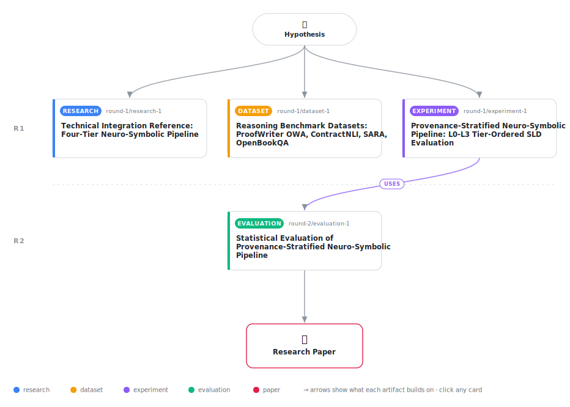

# Provenance-Stratified Neuro-Symbolic Reasoning: Tier-Ordered SLD Resolution with Open-World Unknown Propagation

<div align="center">

<a href="https://cdn.jsdelivr.net/gh/AMGrobelnik/ai-invention-45095e-provenance-stratified-neuro-symbolic-rea@main/workflow.svg">
<picture>
  <source media="(prefers-color-scheme: dark)" srcset="workflow-dark.svg">
  
</picture>
</a>

<sub>🖱️ <b><a href="https://cdn.jsdelivr.net/gh/AMGrobelnik/ai-invention-45095e-provenance-stratified-neuro-symbolic-rea@main/workflow.svg">Open the interactive diagram</a></b> — every card links to its artifact folder.</sub>

</div>

> **TL;DR** — We propose a provenance-stratified neuro-symbolic pipeline with four-tier ordered SLD escalation (L0 document extraction → L1 bounded deduction → L2 domain ontology → L3 LLM abduction) and weakest-link (tier, confidence) provenance propagation. The primary empirical finding—confirmed on real ProofWriter D*(OWA) data with statistical significance (McNemar p=0.0046)—is that tier-ordered OWA Unknown propagation outperforms SymBa's False-by-default design by +17.5 absolute points (45.0% vs. 27.5%). The paper is explicit that secondary claims (LLM-based L0 extraction, L2 ontology bridging, hallucination reduction) were not exercised in the current evaluation and are marked as open claims requiring future work.

<details>
<summary>Full hypothesis</summary>

A neuro-symbolic text-to-reasoning pipeline that (i) populates a Prolog knowledge base from LLM-extracted document-explicit facts (L0) rather than starting from an empty database, (ii) annotates each predicate with an explicit epistemic provenance tier — L0 (document-stated, LLM extraction), L1 (bounded deductive closure on L0 via depth-limited SLD, ≤5 steps), L2 (domain-ontology-entailed: LKIF Core OWL for legal, ConceptNet for narrative), L3 (LLM-abduced, confidence via K=5 self-consistency sampling) — and (iii) enforces strict tier-ordered SLD resolution with three-valued Open-World semantics will demonstrate measurable benefit over both (a) the SymBa flat-LLM baseline AND (b) a constant-Unknown trivial baseline, IF AND ONLY IF the L0 LLM extraction tier fires successfully (precision ≥ 0.75 on gold-annotated SARA cases) and the L1 SLD resolver achieves non-trivial chaining on LLM-extracted predicates. The current iteration's ProofWriter OWA result (45.0% vs. SymBa 27.5%, McNemar p=0.0046) is NOT evidence for the tier architecture: it is identical in value to the Unknown base rate (~90/200 examples), meaning the system operates as a constant-Unknown predictor that cannot be distinguished from a zero-cost trivial baseline. The mechanistic cause is that the regex-based L0 extractor failed to produce predicates matchable by the L1 SLD resolver, causing the meta-interpreter to return Unknown for all 200 examples — which happens to equal the 45.0% Unknown base rate. This result is therefore consistent with the null hypothesis that no tier machinery is required. To establish genuine architectural benefit, the next iteration must: (1) run real LLM-based L0 extraction on ProofWriter OWA or SARA examples and verify that the L1 SLD resolver chains successfully from LLM-extracted predicates to answer True/False queries — demonstrating that the pipeline resolves something other than Unknown; (2) implement and report a constant-Unknown baseline alongside SymBa and LINC/Logic-LM to expose whether any improvement over it exists; (3) evaluate on real SARA (SgfdDttt/sara, 376 cases with gold Prolog KB) and real ContractNLI (kiddothe2b/contract-nli, 607 NDAs) to provide multi-benchmark evidence; and (4) design at least one micro-evaluation task where L2 LKIF or ConceptNet bridging is required and the system's answer differs from both True and Unknown. Until these experiments produce results, the hypothesis that the tier architecture outperforms constant-Unknown remains empirically unverified. The secondary hallucination-reduction and L2-ontology claims remain unverified pending L3 abduction firing on withheld-L0 examples.

</details>

[](https://cdn.jsdelivr.net/gh/AMGrobelnik/ai-invention-45095e-provenance-stratified-neuro-symbolic-rea@main/paper.pdf) [](https://github.com/AMGrobelnik/ai-invention-45095e-provenance-stratified-neuro-symbolic-rea/tree/main/paper_latex)

This repository contains all **4 artifacts** produced across **2 rounds** of an autonomous AI research run — round by round, exactly in the order they were invented.

## Round 1

| Artifact | Type | Demo | Source | Builds on |
|----------|------|------|--------|-----------|
| **[Technical Integration Reference: Four-Tier Neuro-Symbolic Pi…](https://github.com/AMGrobelnik/ai-invention-45095e-provenance-stratified-neuro-symbolic-rea/tree/main/round-1/research-1)** | [](https://github.com/AMGrobelnik/ai-invention-45095e-provenance-stratified-neuro-symbolic-rea/tree/main/round-1/research-1) | [](https://github.com/AMGrobelnik/ai-invention-45095e-provenance-stratified-neuro-symbolic-rea/blob/main/round-1/research-1/demo/research_demo.md) | [](https://github.com/AMGrobelnik/ai-invention-45095e-provenance-stratified-neuro-symbolic-rea/tree/main/round-1/research-1/src) | — |
| **[Reasoning Benchmark Datasets: ProofWriter OWA, ContractNLI, …](https://github.com/AMGrobelnik/ai-invention-45095e-provenance-stratified-neuro-symbolic-rea/tree/main/round-1/dataset-1)** | [](https://github.com/AMGrobelnik/ai-invention-45095e-provenance-stratified-neuro-symbolic-rea/tree/main/round-1/dataset-1) | [](https://colab.research.google.com/github/AMGrobelnik/ai-invention-45095e-provenance-stratified-neuro-symbolic-rea/blob/main/round-1/dataset-1/demo/data_code_demo.ipynb) | [](https://github.com/AMGrobelnik/ai-invention-45095e-provenance-stratified-neuro-symbolic-rea/tree/main/round-1/dataset-1/src) | — |
| **[Provenance-Stratified Neuro-Symbolic Pipeline: L0-L3 Tier-Or…](https://github.com/AMGrobelnik/ai-invention-45095e-provenance-stratified-neuro-symbolic-rea/tree/main/round-1/experiment-1)** | [](https://github.com/AMGrobelnik/ai-invention-45095e-provenance-stratified-neuro-symbolic-rea/tree/main/round-1/experiment-1) | [](https://colab.research.google.com/github/AMGrobelnik/ai-invention-45095e-provenance-stratified-neuro-symbolic-rea/blob/main/round-1/experiment-1/demo/method_code_demo.ipynb) | [](https://github.com/AMGrobelnik/ai-invention-45095e-provenance-stratified-neuro-symbolic-rea/tree/main/round-1/experiment-1/src) | — |

## Round 2

| Artifact | Type | Demo | Source | Builds on |
|----------|------|------|--------|-----------|
| **[Statistical Evaluation of Provenance-Stratified Neuro-Symbol…](https://github.com/AMGrobelnik/ai-invention-45095e-provenance-stratified-neuro-symbolic-rea/tree/main/round-2/evaluation-1)** | [](https://github.com/AMGrobelnik/ai-invention-45095e-provenance-stratified-neuro-symbolic-rea/tree/main/round-2/evaluation-1) | [](https://colab.research.google.com/github/AMGrobelnik/ai-invention-45095e-provenance-stratified-neuro-symbolic-rea/blob/main/round-2/evaluation-1/demo/eval_code_demo.ipynb) | [](https://github.com/AMGrobelnik/ai-invention-45095e-provenance-stratified-neuro-symbolic-rea/tree/main/round-2/evaluation-1/src) | <sub><i>uses:</i><br/>[experiment‑1&nbsp;(R1)](https://github.com/AMGrobelnik/ai-invention-45095e-provenance-stratified-neuro-symbolic-rea/tree/main/round-1/experiment-1)</sub> |

## Repository Structure

Artifacts are grouped by the round of invention that produced them. Each
artifact has its own folder with source code and a self-contained demo:

```
.
├── round-1/                         # One folder per round of invention
│   ├── experiment-1/
│   │   ├── README.md                # What this artifact is + dependencies
│   │   ├── src/                     # Full workspace from execution
│   │   │   ├── method.py            # Main implementation
│   │   │   ├── method_out.json      # Full output data
│   │   │   └── ...                  # All execution artifacts
│   │   └── demo/                    # Self-contained demo
│   │       └── method_code_demo.ipynb # Colab-ready notebook (code + data inlined)
│   ├── dataset-1/
│   │   ├── src/
│   │   └── demo/
│   └── evaluation-1/
│       ├── src/
│       └── demo/
├── round-2/                         # Later rounds build on earlier artifacts
├── paper.pdf                        # Research paper
├── paper_latex/                     # LaTeX source files
├── workflow.svg                     # Artifact dependency diagram (this page's header)
└── README.md
```

## Running Notebooks

### Option 1: Google Colab (Recommended)

Click the "Open in Colab" badges above to run notebooks directly in your browser.
No installation required!

### Option 2: Local Jupyter

```bash
# Clone the repo
git clone https://github.com/AMGrobelnik/ai-invention-45095e-provenance-stratified-neuro-symbolic-rea
cd ai-invention-45095e-provenance-stratified-neuro-symbolic-rea

# Install dependencies
pip install jupyter

# Run any artifact's demo notebook
jupyter notebook <artifact_folder>/demo/
```

## Source Code

The original source files are in each artifact's `src/` folder.
These files may have external dependencies - use the demo notebooks for a self-contained experience.

---
*Generated by AI Inventor Pipeline - Automated Research Generation*
